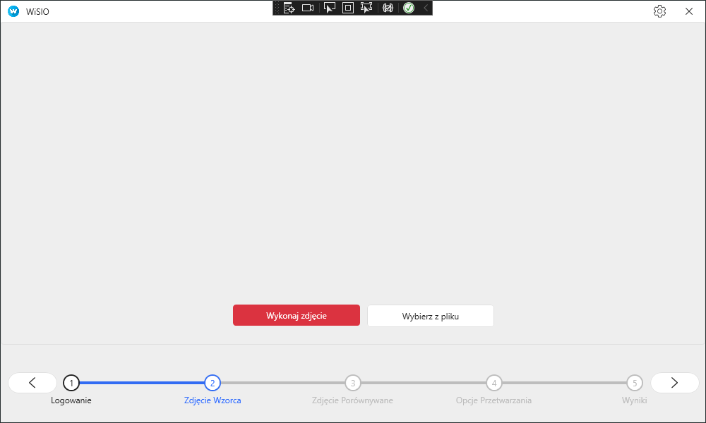
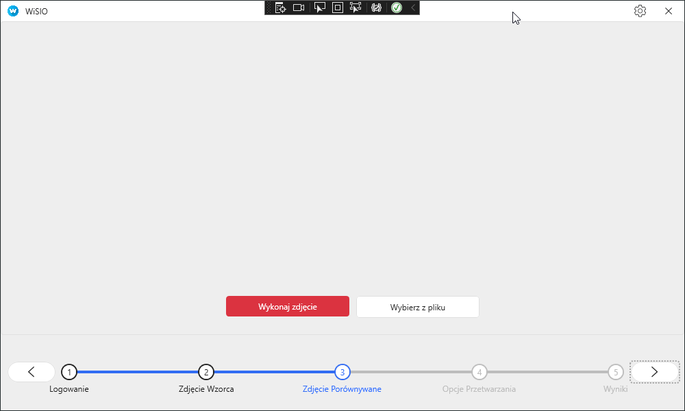

---
bibliography:
- sample.bib
---

# **WiSIO - Wizyjny System Inspekcji Obwodów**

Dokumentacja projektu

28.02.2022 - 14.06.2022

**Wydział Elektroniki Fotoniki i Mikrosystemów**

**Automatyka i Robotyka**

**Komputerowe Sieci Sterowania, Technologie Informacyjne w Automatyce**

Jakub Nowek, Damian Ryś, Grzegorz Rydzyński

# Podział zadań w zespole

-   Damian Ryś (lider) - opracowanie aplikacji zintegrowanej z
    algorytmem oraz systemem wizyjnym

-   Jakub Nowek - praca koncepcyjna nad algorytmem oraz realizacja
    algorytmu w postaci skryptu w języku Python

-   Grzegorz Rydzyński - praca koncepcyjna nad algorytmem oraz
    realizacja algorytmu w postaci skryptu w języku Python

# Wstęp

Projekt został zrealizowany w formie aplikacji, służącej do wykrywania
różnic pomiędzy obrazem wzorcowym, a obrazem wejściowym. W opracowywanym
systemie, obrazem wzorcowym jest obraz płytki drukowana PCB, na której
wszystkie elementy zostały zamontowane poprawnie. Obrazami wejściowymi
są obrazy płytek z tej samej serii produkcji, na których poprawność
montażu elementów ma zostać sprawdzona.\
Płytki mogą być wykonane zarówno w technologii montażu przewlekanego THT
(ang. Through-Hole Technology) jak i technologii montażu
powierzchniowego SMT (ang Surface-Mount Technology).\
Wykrywanie różnic dokonywane jest przy pomocy algorytmu wyszukiwania
wzorca (ang. Template matching).\
Obrazy do analizy pobierane są przy pomocy mikrokomputera Raspberry Pi4B
z dołączoną kamerą pozwalającej na robienie zdjęć w wysokiej
rozdzielczości.

# Objaśnienie słów kluczowych

W poniższej dokumentacji używano następujących słów kluczowych i
konwencji:

-   fragment - wydzielona przy pomocy funkcji tile() część obrazu
    wzorcowego lub fragmentu obrazu wzorcowego;

-   pierwszy piksel obrazu - piksel znajdujący się w lewym górnym rogu
    obrazu;

-   względne przesunięcie fragmentu - przesunięcie fragmentu względem
    części obrazu (lub większego fragmentu), z której pochodzi
    fragment - odległość pomiędzy pierwszym pikselem obrazu, a pierwszym
    pikselem fragmentu tego obrazu;

-   bezwzględne przesunięcie fragmentu - przesunięcie fragmentu względem
    obrazu wzorcowego - odległość pomiędzy pierwszym pikselem obrazu,a
    pierwszym pikselem rozpatrzanego fragmentu.

# Algorytm

## Ogólny opis działania algorytmu

Obraz wzorcowy dzielony jest na prostokątne fragmenty. Każdy fragment
jest następnie wyszukiwany na obrazie wejściowym. Znalezienie fragmentu
wzorca na obrazie wejściowym oznacza, że na odpowiadającym fragmencie
płytki wejściowej nie wykryto różnic, a co za tym idzie, wszystkie
elementy zostały w danej części płytki wejściowej zamontowane poprawnie.
W takim wypadku nie ma potrzeby dalszego procesowania fragmentu. Jeśli
dany fragment wzorca nie zostanie znaleziony na płytce wejściowej,
oznacza to, że płytka wejściowa różni się od wzorca w danym miejscu.\
Fragmenty wzorca, które nie zostały odnalezione na obrazie wejściowym,
mogą zostać podzielone na mniejsze fragmenty, które zostaną następnie
ponownie wyszukane. Zabieg ten zapewnia większą dokładność lokalizacji
błędu i może być powtarzany wielokrotnie.

Po zakończeniu wyszukiwania, znalezione różnice zaznaczane są na obrazie
wzorcowym - każdy prostokątny fragment zaznaczany jest ramką w jaskrawym
kolorze.

## Opis zmiennych wejściowych - argumentów algorytmu

-   ścieżka systemowa do pliku płytki wzorcowej - ścieżka do pliku
    płytki wzorcowej

-   ścieżka systemowa do pliku płytki wejściowej - ścieżka do pliku
    płytki badanej

-   głębokość algorytmu - współczynnik oznaczający ile razy zostanie
    wykonany algorytm

-   próg tolerancji podobieństwa - próg, poniżej którego fragment
    zostanie uznany za błędny

-   wzrost wartości progu tolerancji - współczynnik oznaczający o ile
    próg tolerancji wzrośnie przy wykonywaniu algorytmu dla kolejnych
    warstw (wartość współczynnika wpływa na wartość współczynnika progu
    tolerancji dla głębokości algorytmu $\ge$ 2)

-   dzielnik szerokości - ilość części na które zostanie podzielona oś X
    obrazu

-   dzielnik wysokości - ilość części na które zostanie podzielona oś Y
    obrazu

## Użyte biblioteki

-   cv2 - wersja biblioteki OpenCv przygtowana dla języka Python -
    biblioteka umożliwia wczytywanie, zapisywanie i przetwarzanie
    obrazów, w tym kluczową funkcję cv.matchTemplate(), wykorzystaną do
    obliczania współczynnika podobieństwa.

-   os - biblioteka umożliwiająca wywoływanie funkcji systemowych z
    poziomu skryptu języka Python, wykorzystana, do skanowania i
    usuwania zawartości folderów

-   shutil - biblioteka udostępniająca systemową funkcję służącą do
    przenoszenia plików pomiędzy folderami.

-   sys - biblioteka udostępniająca funkcje umożliwiające wywoływanie
    skryptu w języku python z argumentami. Pozwala to na integrację
    skryptu w języku Python z aplikacją w języku C#.

-   numpy - biblioteka udostępniająca szereg matematycznych funkcji i
    przekształceń. Wykorzystana została jedynie funkcja numpy.where(),
    zwracająca listę argumentów które spełniły określone warunki.

-   PIL - biblioteka umożliwiająca proste przetwarzanie obrazów.
    Wykorzystana została funkcja PIL.Image.open(), która pozwala na
    otwieranie plików obrazów. Działa podobnie do funkcji otwierania
    plików z biblioteki cv2, lecz obraz wczytywany jest w inny sposób.

-   itertools - biblioteka umożliwiająca definiowanie iterowalnych
    obiektów. W funkcji tile() wykorzystana została funkcja
    itertools.product(), pozwalająca na utworzenie listy par elementów
    pochodzących z dwóch list.

## Opis klas, funkcji i metod użytych w programie

### Klasa przechowująca informacje o pojedynczym fragmencie płytki wzorcowej - Fragment

Zmienne klasy:

-   tilefname - nazwa ścieżki systemowej która identyfikuje pojedynczy
    fragment wzorca

-   offset - bezwzględne przesunięcie fragmentu wzorca

### Dzielenie obrazów ma fragmenty - tile()

**tile()** - funkcja odpowiedzialna za dzielenie podanego do niej obrazu
na fragmenty.\
Parametry funkcji:

-   \@param filename: nazwa zdjęcia, które ma zostać podzielone;

-   \@param dir_out: ścieżka katalogu, do którego zostaną zapisane
    fragmenty;

-   \@param tile_list: a list in which names and offset of the tiles
    will be saved lista nazw fragmentów oraz ich przesunięcia względne;

-   \@param div_w: na ile części w osi X ma zostać podzielony
    rozpatrywany fragment w kolejnej iteracji;

-   \@param div_h: na ile części w osi Y ma zostać podzielony
    rozpatrywany fragment w kolejnej iteracji;

-   \@param offset: wektor współrzędnych bezwzględnego przesunięcia
    fragmentu

-   \@return: funkcja zwraca liczbę fragmentów na które podzielony
    został obraz.

Lista kroków:

1.  Wczytaj parametry.

2.  Weź kolejny fragment i oblicz jego przesunięcie względem obrazu.

3.  Dodaj przesunięcie bezwzględne do przesunięcia względnego.

4.  Utwórz instancję klasy Fragment i zapisz w niej ścieżkę do pliku
    fragmentu oraz jego bezwzględne przesunięcie.

5.  Dodaj utworzoną instancję klasy do listy fragmentów.

6.  Zapisz fragment w folderze.

7.  Przesuń się względem lewego górnego rogu obrazu o szerokość
    fragmentu.

8.  Jeśli fragment nie jest ostatnim fragmentem obrazu, powtarzaj kroki
    od 2 do 8.

9.  Zwróć liczbę fragmentów.

   

    <em>Rys. 1: Przesunięcie względne i bezwzględne fragmentu</em>

  

### Wyszukiwanie fragmentów wzorca na obrazie wejściowym - needle_in_hay_stack()

**needle_in_hay_stack()** - funkcja służąca do znajdowania fragmentów
obrazu wejściowego\
Parametry funkcji:

-   \@param haystack_name: nazwa pliku zawierającego płytkę wzorcową

-   \@param number_of_photos: liczba fragmentów na które została
    podzielona płytka wzorcowa

-   \@param list_of_tiles: lista struktur zawierających informacje o
    płytce wzorcowej

-   \@param threshold: próg tolerancji podobieństwa, poniżej którego
    fragment zostanie uznany za błędny

   

    <em>Rys. 2: Schemat blokowy przedstawiający działanie funkcji needle_in_hay_stack()</em>

 
 

### Wyszukiwanie fragmentów wzorca na obrazie wejściowym - match Template() 
 

**matchTemplate()** - porównywanie szablonu z nakładającymi się
obszarami obrazu\
 

Parametry funkcji:

-   \@param image: nazwa pliku zawierającego fragment płytki wzorcowej

-   \@param template: nazwa pliku zawierającego fragment płytki
    wejściowej

-   \@param method: metoda obliczania współczynnika podobieństwa

-   \@return: funkcja zwraca listę współczynników podobieństwa fragmentu
    płytki wzorcowej, do każdego fragmentu płytki wejściowej.

Użyta metoda obliczania współczynnika podobieństwa:\
W realizacji projektu wykorzystano metodę TM_SQDIFF_NORMED:

$$R(x, y)=\frac{\sum{x^{\prime}, y^{\prime}}\left(T\left(x^{\prime}, y^{\prime}\right)-I\left(x+x^{\prime}, y+y^{\prime}\right)\right)^{2}}{\sqrt{\sum{x^{\prime}, y^{\prime}} T\left(x^{\prime}, y^{\prime}\right)^{2} \cdot \sum_{x^{\prime}, y^{\prime}} I\left(x+x^{\prime}, y+y^{\prime}\right)^{2}}}$$

W powyższym wzorze przyjęto następujące oznaczenia:

-   $x$ - położenie na osi X

-   $y$ - położenie na osi Y

-   $x'$ - położenie na osi X

-   $y'$ - położenie na osi Y

-   $T$ - oznacza szablon

-   $I$ - oznacza obraz na którym szukamy szablonu

### Sprawdzenie wzajemnego położenia nieznalezionych fragmentów - check_adjacent()

**check_adjacent()** - funkcja po otrzymaniu dwóch fragmentów, sprawdza,
czy na obrazie wzorowym są one położone w bezpośrednim sąsiedztwie.\
Parametry funkcji:

-   \@param w_tile: szerokość danego fragmentu

-   \@param h_tile: wysokość danego fragmentu

-   \@param x_offset_1: bezwzględne przesunięcie na osi X lewego górnego
    rogu pierwszego fragmentu;

-   \@param x_offset_2: bezwzględne przesunięcie na osi X lewego górnego
    rogu drugiego fragmentu;

-   \@param y_offset_1: bezwzględne przesunięcie na osi Y lewego górnego
    rogu pierwszego fragmentu;

-   \@param y_offset_2: bezwzględne przesunięcie na osi Y lewego górnego
    rogu drugiego fragmentu;

-   \@return: lista flag położeń pierwszego fragmentu względem drugiego;

Funkcja check_adjacent() sprawdza czy badane fragmenty sąsiadują ze
sobą, używając ich bezwzględnych przesunięć na osi X i Y, oraz
szerekości i wysokości fragmentu. W funkcji tworzona jest pusta lista,
do której zapisywane są znaki, które oznaczają położenie jednego
fragmentu względem drugiego. Sprawdzanie, czy pierwszy fragment znajduje
się w sąsiedztwie drugiego, otrzymywane jest poprzez jednoczesne
sprawdzenie dwóch warunków:

-   Czy wartość bezwzględna z różnicy przesunięć obu fragmentów,
    podzielona przez szerokość lub wysokość fragmentu jest równa $1.0$.

-   Czy wartości drugiego przesunięcia (niebadanego w warunku pierwszym)
    są równe.

Jeśli pierwszy fragment jest w sąsiedztwie drugiego fragmentu, różnica
ich przesunięć bezwzględnych powinna być równa szerokości (lub
wysokości) pojedynczego fragmentu. To nie jest jednak warunek
wystarczający aby stwierdzić czy fragment pierwszy znajuje się w
sąsiedztwie fragmentu drugiego. Drugi warunek sprawdza, czy oba
fragmenty znajdują się na tej samej wysokości (lub szerokości). Jeśli
oba warunki są spełnione, funkcja zapisuje do listy flag odpowiedni
znak. Funkcja najpierw sprawdza czy fragmenty podane jako argumenty
funkcji sąsiadują ze sobą w osi poziomej, a następnie czy sąsiadują ze
sobą w osi pionowej.

## Szczegółowy opis działania algorytmu

1.  Po wywołaniu algorytmu definiowane są listy fragmentów
    wykorzystywane w algorytmie, zapisywane są ścieżki obrazu wynikowego
    oraz badanego, oraz tworzone są katalogi, do których będą zapisywane
    fragmenty płytki w trakcie działania algorytmu.

2.  Następnie obraz wynikowy dzielony jest na fragmenty za pomocą
    funkcji tile(). Fragmenty obrazu zostają następnie zapisane do listy
    oraz do osobnego katalogu i są przekazywane dalej do funkcji
    wyszukiwania fragmentów wzorca na obrazie badanym
    needle_in_hay_stack().

3.  W funkcji needle_in_hay_stack() z listy fragmentów płytki wzorcowej
    usuwane są te fragmenty, które zostały znalezione na płytce badanej
    (jeśli fragment został znaleziony na płytce badanej oznacza to że
    nie było różnicy). Funkcja wyświetla odpowiedni komunikat w
    zależności od tego czy fragment został znaleziony czy nie.

4.  Z katalogu, w którym zapisywane są fragemnty zawierające błędne,
    usuwane są fragmenty na których nie znaleziono błędu (zostały
    znalezione przez funkcję needle_in_hay_stack()).

5.  Następnie na podstawie argumentów wejściowych algorytmu definiowane
    są współczynniki głębokości algorytmu, progu wykrywania błędu oraz
    wzrostu progu wraz ze wzrostem głębokości. Współczynniki te zostaną
    następnie podane do pętli.

6.  Następnie w pętli dla każdego błędnego fragmentu płytki wykrytego
    podczas pierwszego wywołania algorytmu zostają wykonane te same
    czynności co dla oryginalnych obrazów - fragment dzielony jest na
    mniejsze fragmenty, które następnie są porównywane z fragmentami na
    płytce wzorcowej. P

7.  Jeśli lista znalezionych różnic nie jest pusta (znaleziono róznicę
    pomiędzy płytką wzrocową a płytką badaną), obliczna jest szerokość
    oraz wysokość pojedynczego fragmentu na podstawie jego wektora
    przesunięć. Następnie, na podstawie rozmiaru obrazu dostosowywana
    jest szerokość obramowania błędnego fragmentu płytki.

8.  Wywoływana jest pętla, w której najpierw sprawdzane jest sąsiedztwo
    wszystkich wykrytych błędnych fragmentów płytki za pomocą funkcji
    check_adjacent(), następnie rysowane są obramowania błędnych
    fragmentów płytki. Dla każdego błędnego fragmentu płytki rysowane
    jest obramowanie o grubości zależnej od wyniku algorytmu sprawdzania
    sąsiedztwa. Następnie fragment z obramówką wklejany jest do
    wynikowego obrazu w miejsce wyznaczone przez jego wektor położenia
    względem płytki.

9.  Obraz wynikowy zapisywany jest do osobnego pliku .png, a następnie
    przekazywany jest do wyświetlenia w aplikacji.

# Aplikacja

Aplikacja została w napisana w technologii .Net korzystając z języka C#
oraz silnika WPF. Istotne jest to, że w ramach komunikacji łączymy się
przy pomocy protokołu ssh z Raspberry PI, na której wykonujemy
odpowiednie shellowe skrypty, które wykonywane są z katalogu głównego
(/home/pi). Można wykonywać je z innego katalogu jednak wymaga to
utworzenia interaktywnej powłoki i ręcznie zarządzanie przepływem danych
co z racji swojego sporego skomplikowania i małego znaczenia w projekcie
zostało pominięte w implementacji.

## Ogólny opis działania aplikacji

Sposób użytkowania aplikacji jest intuicyjny i opiera się na kolejnym
przechodzeniu przy pomocy strzałek pomiędzy ekranami w celu uzupełnienia
niezbędnych informacji koniecznych do przetworzenia obrazu.

### Ekran 1

Na pierwszym ekranie mamy opcjonalną opcję zalogowania się do Raspberry
PI. Potrzebujemy do tego adresu IP, loginu oraz hasła do autoryzacji się
z urządzeniem. Domyślnym danymi logowania są:

-   login - pi

-   hasło - interelcom

Po zalogowaniu wyświetli się komunikat sygnalizujący nawiązania
połączenia. Uzyskujemy wtedy dostęp do opcji podglądu z kamery oraz
wykonywania zdjęć w dalszych krokach. Na tym panelu warto sprawdzić
podgląd w celu weryfikacji prawidłowego ustawienia płytki.

   

    <em>Rys. 3: Ekran logowania</em>

 

### Ekran 2

Na tym ekranie musimy wskazać płytkę wzorcową: możemy zrobić zdjęcie
przy pomocy aplikacji lub wybrać już gotowe zdjęcie.

 

    <em>Rys. 4: Wybieranie płytki wzorcowej</em>

 

### Ekran 3

Na tym ekranie musimy wskazać płytkę porównywaną: możemy zrobić zdjęcie
przy pomocy aplikacji lub wybrać już gotowe zdjęcie.

 

    <em>Rys. 5: Wybieranie płytki porównywanej</em>

 

### Ekran 4

Na tym ekranie musimy wybrać odpowiednie wartości algorytmu, jeżeli nie
wskażemy żadnej wartości ustawione zostaną wartości domyślnej. Po prawej
stronie możemy śledzić wykonywanie się algorytmu.

 

    <em>Rys. 6: Ekran opcji przetwarzania algorytmu</em>

 

### Ekran 5

Na końcowym ekranie po lewej znajdują się porównanie dwóch zdjęć płytek,
a po prawej wynik naszego algorytmu. Możemy go w dowolny sposób
manipulować: obracać, przybliżać, zapisać do wskazanej ścieżki do pliku

 

    <em>Rys. 7: Ekran wynikowy aplikacji</em>

 

## Użyte biblioteki

-   HandyControl- biblioteka nadpisująca wizualnie wiele podstawowych
    elementów WPF oraz dodająca własne rozszerzenia funkcjonalności.
    Odpowiada ona za całą szatę graficzną aplikacji. Aktualną wersję
    dokumentacji można znaleźć pod adresem
    <https://ghost1372.github.io/handycontrol/>.

-   SSh.Net - biblioteka pozwalająca na łatwe nawiązywanie bezpiecznego
    połączenia za pomocą protokołu ssh wykorzystywanego do komunikacji z
    RaspberryPi. Aktualną wersję dokumentacji wraz z przykładowym kodem
    znajduję się pod adresem <https://github.com/sshnet/SSH.NET>.

# Przykładowy wynik działania algorytmu

Ponieważ program w aktualnej wersji nie obsługuje przycinania obrazu,
obrazy wzorcowy i wejściowy zostały ręcznie przycięte w celu
zmniejszenia złożoności czasowej. Płytki na zdjęciach zostały
dostarczone przez firmę InterElcom. Na płytce wejściowej spreparowano
błędy, by sprawdzić skuteczność algorytmu.

 

    <em>Rys. 8: Obraz przyciętej płytki wzorcowej.</em>

 

 

    <em>Rys. 9: Obraz przyciętej płytki wejściowej.</em>

 

 

    <em>Rys. 10: Obraz przyciętej płytki wejściowej z zaznaczonymi
różnicami.</em>

 

Dobrane doświadczalnie parametry:

-   Stopień głębokości algorytmu: 1

-   Próg wykrywania pierwszej warstwy: 0.075

-   Zwiększenie progu co warstwę: zostawiono domyślną wartość, ponieważ
    stopień głębokości wynosi 1.

-   Parametr dzielenia płytki w osi X: 3

-   Parametr dzielenia płytki w osi Y: 2

 

    <em>Rys. 11: Ekran 4 aplikacji - ilustracja operacji
przetwarzania.</em>

 

 

    <em>Rys. 12: Płytka wynikowa - efekt działania
programu.</em>

 

 

    <em>Rys. 13: Widok okna aplikacji po zakończeniu działania
algorytmu.</em>

 

# Wnioski

Porównując obraz wynikowy otrzymany za pomocą algorytmu oraz obraz z
zaznaczonymi różnicami (Rys.12, Rys.10) można zauważyć, że algorytm
zaznaczył większość różnic widocznych na płytce. Algorytm poprawnie
wykrył brak elementów, źle przylutowane elementy, obrócone elementy oraz
przesunięte switche. Nie zostały jednak wykryte spalone piny. Dzieje się
tak głównie ze względu na jakość wykonanego zdjęcia oraz dobór
parametrów do algorytmu. Zaznaczenie większej ilości fragmentów płytki w
miejscach gdzie nie ma błędów wynika z warunków oświetleniowych
stanowiska, ustawienia płytki oraz dokładności zdjęcia. Wynik działania
algorytmu można poprawić wykonując zdjęcia w niezmiennym otoczeniu przy
dobrym oświetleniu.\
Należy również nadmienić, że na wynik działania programu przy
wykorzystanej metodzie może wpływać przesunięcie siatki elementów
względem powierzchni płytki oraz w przypadku elementów większych, ich
odchylenie.

Co więcej, parametry podawane aplikacji powinny być indywidualnie
dobrane dla każdej serii testów oraz dla każdego stanowiska.

# Możliwe problemy

## Algorytm

-   Utrata piksela spowodowana dzieleniem zdjęcia na mniejsze fragmenty
    może powodować pogrubienie granic pomiędzy fragmentami przez źle
    wyliczony offset. Rozwiązaniem byłoby dostosowanie rozmiarów
    fragmentów tak, by w razie nieparzystej liczby pikseli, jeden z
    fragmentów był większy.

-   Duże wartości div_x i div_y mogą powodować spore utraty danych.
    Obecnie podczas każdego podziału, obraz jest dzielony na równe
    fragmenty, co może być problematyczne przy nieparzystych ilościach
    pikseli obrazu. Rozwiązanie problemu identyczne jak w przypadku
    utraty piksela.

-   Przy zbyt małych wielkościach fragmentów do wyszukania (dużych
    wartościach div_x i div_y), wyszukiwanie może dawać fałszywie
    pozytywne lub negatywne wyniki. Z punktu widzenia procesu, pożądane
    są jak najmniejsze fragmenty, ponieważ pozwala to na dokładniejsze
    zlokalizowanie różnic. Ponieważ do rozpoznawania różnic użyto metody
    wyszukiwania wzorca (*template matching*), należy pamiętać, że przy
    zbyt małym rozmiarze wzorca, utracone zostaną dane o szczegółach
    obrazu. Należy zatem dostosować wartości tych zmiennych do
    konkretnego obrazu wzorcowego.

-   Brak walidacji parametrów wejściowych w algorytmie. Rozwiązaniem
    byłoby dodanie ograniczeń i kontroli wprowadzania danych w
    algorytmie.

## Aplikacja

-   Aplikacja może zwracać nieobsługiwane wyjątki ze względu na
    ograniczony czas na testy manualne.

# Dalszy rozwój

## Algorytm

-   Wprowadzenie asynchronicznego wywoływania programu dla dalszych
    stopni głębokości algorytmu powinno znacząco usprawnić złożoność
    czasową algorytmu kosztem złożoności pamięciowej. Należy jednak
    pamiętać o nałożeniu limitu wykonywanych naraz wątków ze względu na
    bardzo szybko rosnącą ilość jednoczesnych operacji mogących
    wykonywać się w tym samym czasie.

-   Istnieje również możliwość przepisania algorytmu na inny język
    posiadający wsparcie zawartych bibliotek (np. Rust) w celu
    zwiększenia szybkości przetwarzania obrazu.

-   W dalszej perspektywie możliwe jest utworzenie bazy danych błędów
    lutowniczych ( niestety nie istnieje open-source'owa baza takich
    elementów), na której podstawie możliwe jest utworzenie modelu do
    uczenia maszynowego, który powinien lepiej sprawdzić w tym zadaniu.
    Możliwa by była również dzięki temu automatyczna identyfikacja
    rodzaju wykrytych błędów.

## Aplikacja

-   Modyfikacja metod na asynchroniczne dla wywoływanych skryptów
    robiących zdjęcia na Raspberry PI.

-   Dodanie metod do obróbki zdjęć (obracanie, przycinanie (automatyczne
    lub przez użytkownika)).

## Stanowisko

-   Utworzenie stałego stanowiska z statywem, odpowiednim oświetleniem
    oraz softboxami.

-   Implementacja elementu lub uchwytu, zapewniającego jednakowe
    ułożenie wszystkich płytek podczas wykonywania zdjęć.

## Ogólne

-   Dodanie pipeline'u pozwalającego na automatyczne generowanie
    aplikacji po wprowadzeniu zmian w kodzie.

# Użyte urządzenia i oprogramowanie

 

    <em>Rys. 14: Raspberry Pi4</em>

 

Specyfikacja:

-   2GB pamięci RAM

-   64-bitowy ARM-8 Cortex-A72 1,5 GHz

-   2 złącza microHDMI

-   2 złącza USB 3.0

-   2 złącza USB 2.0

-   złącze zasilania USB C

-   40 złącz GPIO,

-   złącza CSI i DSI

-   slot karty pamięci (microSD)

-   zainstalowany system operacyjny *Raspberry Pi OS*

 

    <em>Rys. 15: Kamera RbPi HQ</em>

 

Specyfikacja:

-   sensor IMX477 o rozdzielczości 12,3 MPx

-   zdjęcia do 12 bitów RAW

-   wbudowane mocowanie do statywu

-   regulowane ustawienie ostrości za obiektywem

-   kompatybilna z obiektywami C-mount i CS-mount

-   kompatybilna z wszystkimi komputerami Raspberry Pi

 

    <em>Rys. 16: Obiektyw.</em>

 

Specyfikacja:

-   długość ogniskowej 16mm

-   rozdzielczość 10MPx

-   apertura F1. 4-16

-   zmienny kąt widzenia: 1\"; 2/3\"; 1/1,8\"; 1/2\"

# Bibliografia

-   Lutz, Mark. *Python, wprowadzenie*. Helion, Gliwice, 2020.

-   McKinney, Wes. *Python w analizie danych*. Helion, Gliwice, 2018.

-   <https://docs.opencv.org/4.x/d4/dc6/tutorial_py_template_matching.html> -
    ostatni dostęp 21.06.2022

-   <https://ghost1372.github.io/handycontrol/> - ostatni dostęp
    21.06.2022

-   <https://github.com/sshnet/SSH.NET> - ostatni dostęp 21.06.2022

# Oświadczenie o nienaruszeniu praw autorskich

Oświadczamy, że jesteśmy autorami projektu pt. \"Wizyjny System
Inspekcji Obwodów\" i zgodnie z ustawą z dnia 4 lutego 1994 roku o
prawie autorskim i prawach pokrewnych (t.j. Dz. U. z 2006 roku nr 90,
poz. 631 z późn. zm.) dysponujemy prawami autorskimi do tego projektu.
